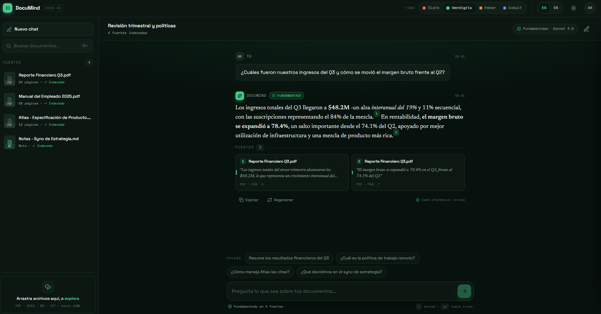
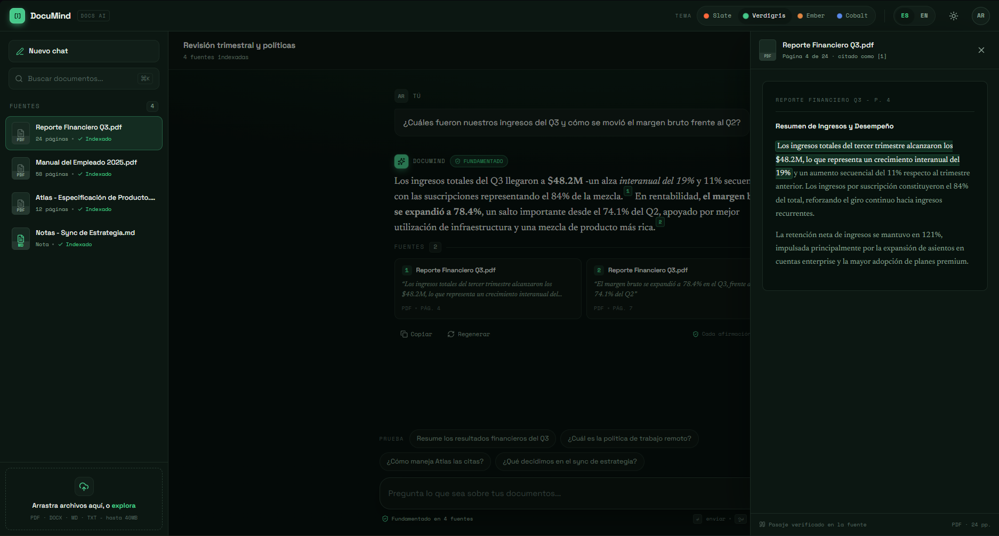
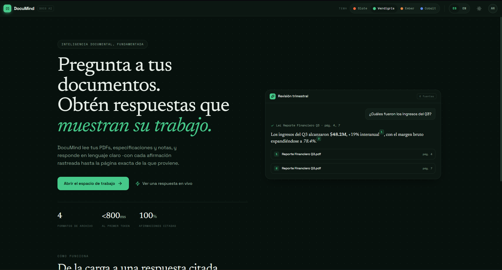

# DocuMind - AI Document Assistant with Source Citations

> Ask questions about your documents and get answers that **show their work** - every
> claim traced to the exact document and page it came from.

[](https://react.dev)
[](https://www.typescriptlang.org)
[](https://vite.dev)
[](https://tailwindcss.com)

**🔗 Live demo:** _https://your-app.vercel.app_ &nbsp;·&nbsp; built by [@MaikelHR](https://github.com/MaikelHR)

> ⚠️ **This is a front-end portfolio demo.** The answers, documents, retrieval and
> "streaming" are **simulated client-side** (no real LLM or backend yet). The focus is
> UI craft, architecture and a clean, *backend-ready* design - see
> [Wiring a real backend](#wiring-a-real-backend-rag).

---

## What it is

DocuMind is an AI document assistant whose differentiator is the **citation experience**:
inline citation markers, a source card under every claim, and a slide-in panel that opens
the original document with the cited passage highlighted. It ships **bilingual (Spanish
primary / English)**, **light + dark** modes, and **four** selectable color directions.

## Screenshots

_Add three PNGs to `docs/` (workspace, source drawer, landing) and uncomment the table
below. The live deploy is the best showcase - keep the link at the top up to date._

<!--
| Workspace (chat + citations) | Source drawer | Landing |
| :--: | :--: | :--: |
|  |  |  |
-->

## Features

- **Grounded answers with citations** - inline `[n]` markers, a 2-column source grid, and a
  hover link between a marker and its source card (shared highlight state per message).
- **Source drawer** - slides in over the chat, renders the original page, wraps the cited
  snippet in `<mark>`, flashes it, and auto-scrolls it into view.
- **Streaming UX** - three phases (retrieval → token-by-token streaming → done) with a
  blinking cursor and a Stop control. Designed to swap 1:1 for a real streamed completion.
- **8 themes** - 4 color directions × light/dark, implemented as CSS variables driven by
  `data-direction` / `data-mode` on `<html>`, persisted to `localStorage` (+ no-flash boot).
- **Bilingual** - UI chrome via `react-i18next`; sample *data* (doc names, page content,
  snippets) resolved with a small `pick()` helper. Citation snippets are exact substrings of
  the same-language page text, so the highlight matches in both languages.
- **Document management (mock)** - upload (with an indexing animation), delete, search,
  empty state, and "load a sample workspace".
- **Responsive** - two-pane ≥ 940px; off-canvas sidebar + hamburger below; further
  compaction below 600px.
- **Accessible & polished** - `:focus-visible` rings, ARIA tablists, and
  `prefers-reduced-motion` support.

## Tech stack

- **Vite + React 19 + TypeScript** (strict)
- **Tailwind CSS v3** - color tokens mapped to per-theme CSS variables
- **react-i18next** - single-brace interpolation to reuse the source strings verbatim
- **lucide-react** for icons + a hand-authored brand `Logo`

## Architecture notes

- **Theming without 8 Tailwind palettes.** Each palette is a block of CSS custom properties
  scoped to `[data-direction][data-mode]`; Tailwind's `colors` map to those vars
  (`bg-surface`, `text-text-dim`, `border-border`…), so utilities resolve per-theme.
- **Markup + streaming.** A tiny parser turns answer strings (`**bold**`, `*italic*`,
  `[[n]]`) into ordered segments, then into *units* (word/whitespace tokens; each `[[n]]`
  atomic) so citations land in place while text streams in word-by-word.
- **State.** Local component state + two contexts (i18n, theme via `<html>` attributes). The
  chat is a small state machine over message phases - no Redux needed.
- **Discriminated unions** model `Message` (`user | ai`) for safe rendering of each phase.

```
src/
├─ App.tsx              # root state machine: view, theme, lang, docs, messages, streaming
├─ index.css           # design system (theme tokens, components, keyframes) + Tailwind
├─ types.ts            # Doc, Cite, Unit, Message (discriminated union), …
├─ i18n/               # i18next config, es/en resources, usePick() for bilingual data
├─ data/sample.ts      # sample docs, seeded conversation, answer bank (the "mock backend")
├─ lib/markup.ts       # parseMarkup / buildUnits / plainText
└─ components/         # TopBar, Sidebar, Composer, Landing, … + chat/ (Message, Sources,
                       #   Retrieval, SourceDrawer, …)
```

## Getting started

```bash
npm install
npm run dev      # http://localhost:5173
npm run build    # type-check (tsc -b) + production build to dist/
npm run preview  # serve the production build locally
```

Requires Node 20+.

## Deploy (Vercel)

This is a static SPA - Vercel auto-detects Vite (build `npm run build`, output `dist/`).

```bash
npm i -g vercel
vercel        # preview deploy
vercel --prod # production deploy
```

Or import the repo at [vercel.com/new](https://vercel.com/new) and accept the defaults.

## Wiring a real backend (RAG)

The simulation is deliberately isolated so it can be replaced with a real
retrieval-augmented pipeline without touching the UI:

| Mock today | Replace with |
| --- | --- |
| `send()` in `App.tsx` (setTimeout/setInterval) | `fetch('/api/chat')` streamed over **SSE/`ReadableStream`** - keep the same `thinking → streaming → done` phases |
| `pickAnswer()` + arrays in `data/sample.ts` | Real **retrieval + generation**: top-k hybrid search → LLM (e.g. Claude) constrained to cite only retrieved passages |
| `addDoc()` indexing animation | `POST /api/documents`: parse pages → chunk → embed → upsert to a vector store (pgvector / Qdrant / Pinecone) |
| Citation snippets in sample data | Citations returned by the model (`docId`, `page`, char offset) |

## Credits

Implemented from a high-fidelity design handoff (look, motion and behavior spec). All UI,
theming and interactions re-built as production React + TypeScript + Tailwind.

## License

MIT © [MaikelHR](https://github.com/MaikelHR)
